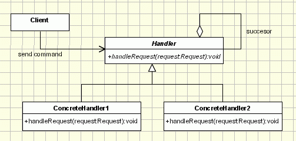
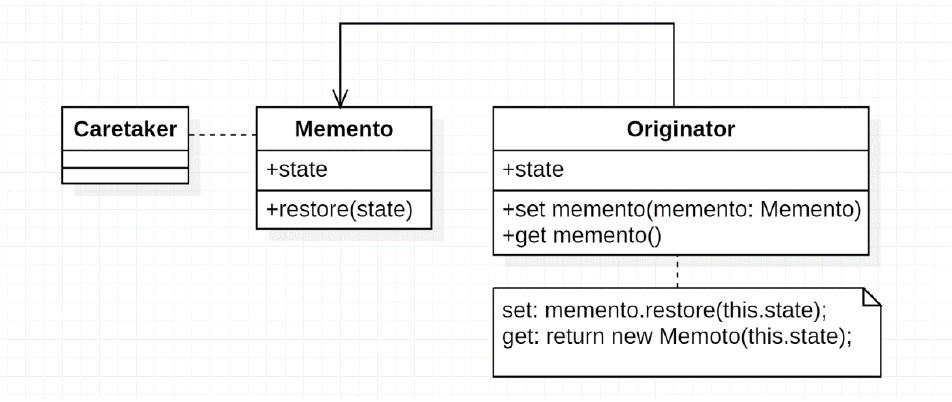
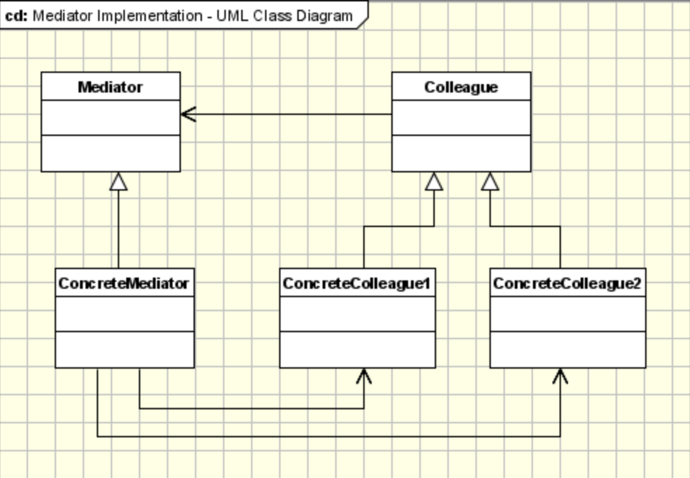
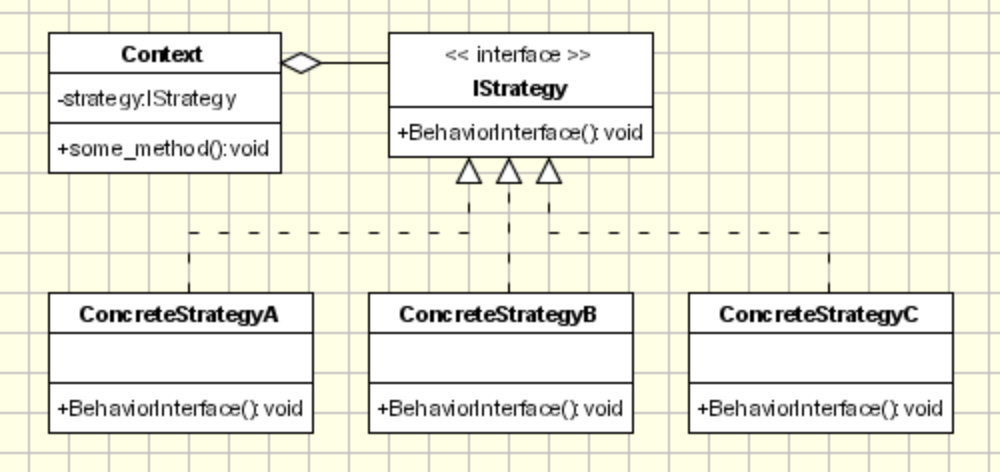

# Behavior Design Pattern

Behavioral design pattern are patterns about how objects or classes interact with each other. The implementation of behavioral design pattern usually requires certain data structures to support the interaction in a system. However, behavioral patterns and structural patterns focus on different aspects when applied.

* **Chain of responsibility**
Organizes behaviors with different scopes.

* **Command Patter**
Exposes commands from the internal with encapsulated context.

* **Memento**
Provides an approach for managing states outside of their owners without exposing detailed implementations.

* **Iterator**
Provides a universal interface for traversing.

* **Mediator**
It groups coupling and logically related objects and makes interconnections cleaner in a system that manages many objects.

* **Strategy pattern**
It's common that a program has similar outlines for processing different targets with
different detailed algorithms. Strategy Pattern encapsulates those algorithms and makes
them interchangeable within the shared outline.

