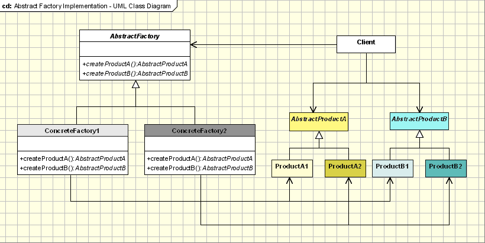

# Creational Design Patterns

Creational design patterns in object-oriented programming are design patterns that are to be applied during the instantiation of objects.

* **Factory method**: By using abstract methods of a factory instead of the constructor to build instances, this allows subclasses to change what's built by implementing or overriding these methods.

* **Abstract factory**: Defining the interface of compatible factories and their products. Thus by changing the factory passed, we can change the family of built products.

* **Builder**: Defining the steps of building complex objects, and changing what's built either by changing the sequence of steps, or using a different builder implementation.

* **Prototype**: Creating objects by cloning parameterized prototypes. Thus by replacing these prototypes, we may build different products.

* **Singleton**: Ensuring only one instance (under a certain scope) will be created.

