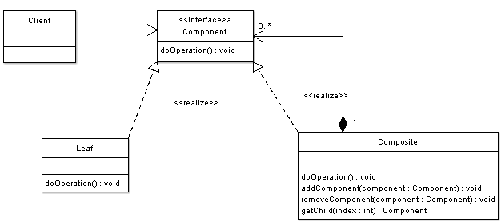
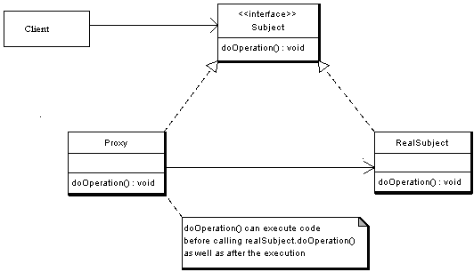

# Structural Design Patterns

While creational patterns play the part of flexibly creating objects, structural patterns, on the other hand, are patterns about composing objects.

* **Composite:** Builds tree-like structures using primitive and composite objects. A good example would be the DOM tree that forms a complete page.

* **Decorator:** Adds functionality to classes or objects dynamically.

* **Adapter:** Provides a general interface and work with different adaptees by implementing different concrete adapters. Consider providing different database choices for a single content management system. 

* **Bridge:** Decouples the abstraction from its implementation, and make both of them interchangeable.

* **Façade:** Provides a simplified interface for the combination of complex subsystems.

* **Flyweight:** Shares stateless objects that are being used many times to improve memory efficiency and performance.

* **Proxy:** Acts as the surrogate that takes extra responsibilities when accessing objects it manages.

